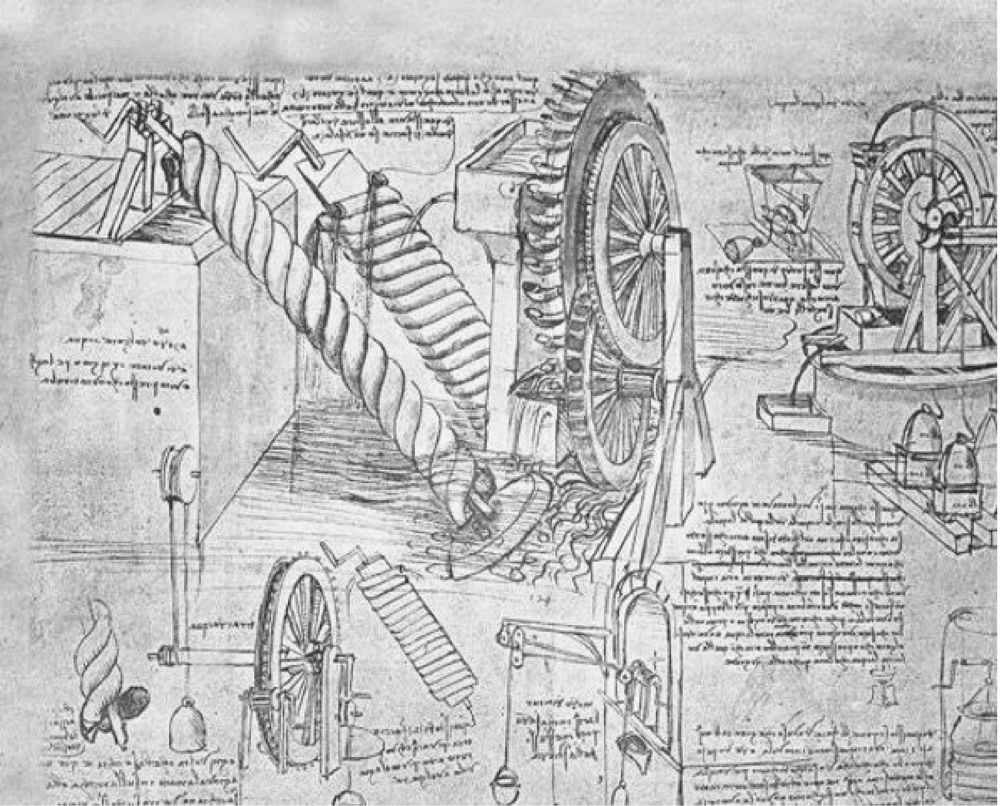

<!-- image: https://andngdtudk.github.io/images/davinci-01.png -->

# Thinking in Systems: An Introduction to My Research Blog Series on Intelligence, Control, and Mobility

Since the dawn of civilization, humans have been system builders.

Long before we had the language of mathematics or the science of engineering, we were already intervening in the natural world to shape it for our survival and prosperity. Early hunter–gatherer societies learned to manage the timing and location of hunts (Ember, 2020). Agricultural communities developed irrigation networks to bring water to their crops, terraced hillsides to maximize arable land, and domesticated animals to share labor. These interventions were not random; they were purposeful manipulations of natural systems to create stability and predictability (Ozdogan, 2020).

Over time, these localized interventions scaled into infrastructures that supported entire civilizations. We constructed roads to connect cities, ports to facilitate trade, and governance systems to coordinate collective action. The development of writing itself can be seen as a systemic intervention — a way to store, transmit, and manage information beyond the limits of human memory (Dalgaard, 2021).

<figure>
    
    <figcaption>
        Leonardo da Vinci’s sketches of water-lifting devices
         
        
            Illustrating early system designs for water-lifting mechanisms, these interconnected mechanical components exemplify how humans have long engineered solutions to control and manipulate natural resources — an early form of systems thinking.
        
         
        
            Source: <a href="https://www.incose-cc.org/blog/systems-engineering-now-more-than-ever">INCOSE-CC Blog</a>
        
    </figcaption>
</figure>

## From Natural to Engineered Systems

The Industrial Revolution marked a profound shift. Our interventions were no longer limited to adapting natural systems; we began to design artificial systems from the ground up. Steam engines, railways, power grids, and mass production lines created a level of complexity and interdependence never before seen. With industrialization came new control challenges: how to maintain stability in mechanical systems, how to synchronize operations, and how to coordinate supply and demand at scale. This period saw the birth of control theory, operations research, and the mathematical study of systems — disciplines that would later form the foundation for managing much more complex, dynamic networks (Andrei, 2006).

## The Information Age and the Rise of Intelligent Systems

The late 20th century brought another transformation with the digitization of systems. Information could now flow faster than goods or people, and networks became as much about signals as about physical materials. Logistics chains, financial markets, and communication infrastructures were increasingly automated. Decision-making rules were embedded directly into machines, from autopilot systems in aircraft to traffic signal controllers in cities.

Then came the era of artificial intelligence. Machine learning allowed systems to adapt based on data rather than solely on pre-programmed instructions. Reinforcement learning enabled them to learn optimal behaviors through interaction. And in many domains — transportation, energy, manufacturing — we began to see multi-agent systems emerge, where many decision-making entities operate and interact within the same environment (Sutton, 1998).

    

<figcaption style="text-align: center;">
    Figure 2: The Enigma machine
     
    
         An electro-mechanical cipher device used by Nazi Germany during World War II to encrypt military communications. Its complexity and adaptability made it a formidable cryptographic system until Allied codebreakers, most notably at Bletchley Park, successfully deciphered its codes — a breakthrough that significantly influenced the outcome of the war.  
    
     
    
        Source: <a href="https://www.dtu.dk/english/newsarchive/2023/01/krypteringstidslinje">DTU — Encryption Timeline</a>
    
</figcaption>

## Enter Physical AI

We have now entered a stage where intelligent systems interact with the physical world — what is often called _Physical AI_. These systems perceive the world through sensors, make decisions based on learned or optimized policies, act in ways that change their environment, and adapt to uncertainty, disturbances, and changing objectives. Autonomous vehicles navigating city streets, drones delivering packages, robotic warehouses organizing inventory, and AI-driven traffic control systems managing urban congestion are all examples of Physical AI in action (NVIDIA Corporation, n.d.).

With this capability comes new complexity. We must ask how to ensure safety and reliability when decisions are made autonomously, how to model and predict the behavior of a system made up of many interacting intelligent agents, and how to design control mechanisms that remain effective under uncertainty and incomplete information. These are the kinds of questions that drive my own research.

## Why Start with Systems Thinking?

All of these examples — from ancient irrigation channels to modern autonomous vehicles — share one thing: they are systems. A system is more than a collection of parts. It is a set of elements connected by relationships, operating within a boundary, and serving a purpose. Understanding systems requires identifying their components, studying how they influence one another, tracing feedback loops, and recognizing the emergence of new patterns from these interactions (Mobus, 2022). 

Systems thinking is the lens that lets us connect concepts from different disciplines. Whether it is a biological ecosystem, a transportation network, or a fleet of autonomous robots, the fundamental challenges of stability, adaptability, efficiency, and resilience are shared.

## Why This Blog Series?

I work at the intersection of machine learning, operations research, and control, with a focus on applying reinforcement learning to optimize large-scale, multi-agent systems in transportation and logistics. In this space, I have noticed that seemingly unrelated fields often address the same underlying problems from different perspectives. Complex, real-world problems demand a cross-disciplinary approach, and understanding why certain methods work requires stepping back and seeing the bigger picture.

This blog series is my attempt to explore that bigger picture. We will start with the foundations — what a system is and how we model it — and move toward modern methods for decision-making in dynamic, uncertain, multi-agent environments. Along the way, we will touch on complexity science, game theory, optimization, control theory, reinforcement learning, model-based approaches, AlphaZero, and the emerging fields of Agentic and Physical AI, with applications in transportation and logistics.

## Closing Thoughts

From our earliest interventions in nature to today’s autonomous systems, the arc of human innovation has been one of system design, control, and adaptation. We have moved from shaping landscapes to shaping flows of data, decisions, and actions. As our systems become more intelligent, our responsibility to understand them grows.

In the next post, we will return to the foundation: **What exactly is a system — and why does that question matter for the future of AI and mobility?**

Andrei, N. (2006). Modern control theory: A historical perspective. _Studies in Informatics and Control, 10_(1), 51–62. [https://www.sic.ici.ro/wp-content/uploads/2006/200601_07.pdf](https://www.sic.ici.ro/wp-content/uploads/2006/200601_07.pdf)

Dalgaard, C.-J., Kaarsen, N., Olsson, O., & Selaya, P. (2018). Roman roads to prosperity: Persistence and non-persistence of public infrastructure. _The Economic Journal, 128_(616), 1394–1426. [https://doi.org/10.1111/ecoj.12482](https://doi.org/10.1111/ecoj.12482)  

Ember, C. R. (2020). Hunter-gatherers (foragers). In _Explaining human culture_ (pp. 1–19). Human Relations Area Files. [https://hraf.yale.edu/ehc/summaries/hunter-gatherers](https://hraf.yale.edu/ehc/summaries/hunter-gatherers)

Ozdogan, M., & Rodell, M. (2020). Irrigation of world agricultural lands: Evolution through the millennia. _Water, 12_(5), 1285. [https://doi.org/10.3390/w12051285](https://doi.org/10.3390/w12051285)

NVIDIA Corporation. (n.d.). _What is physical AI?_ NVIDIA. [https://www.nvidia.com/en-us/glossary/generative-physical-ai/](https://www.nvidia.com/en-us/glossary/generative-physical-ai/)

Mobus, G. E. (2022). Principles of systems science. In _Systems science: Theory, analysis, modeling, and design_ (pp. 41–87). Springer International Publishing. [https://doi.org/10.1007/978-3-030-97559-0_2](https://doi.org/10.1007/978-3-030-97559-0_2)

Sutton, R. S., & Barto, A. G. (2018). _Reinforcement learning: An introduction_ (2nd ed.). MIT Press. [http://incompleteideas.net/book/the-book-2nd.html](http://incompleteideas.net/book/the-book-2nd.html)
