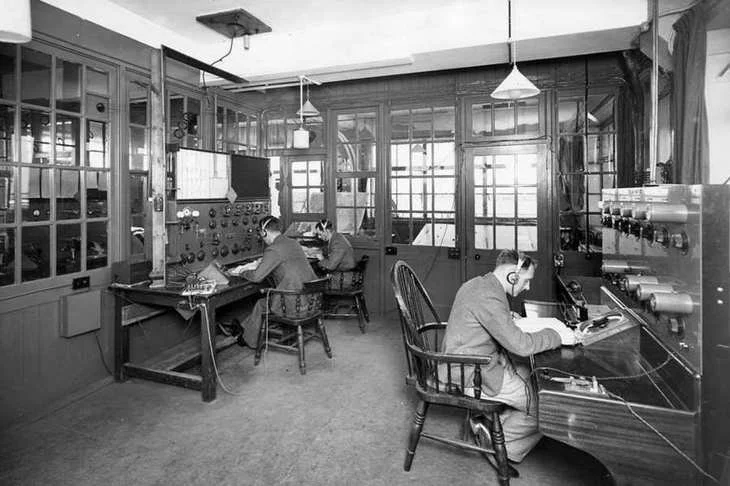

<!-- image: control-room.webp -->

# Control Theory: Foundation and Practice

Control theory is a field of engineering and mathematics that focuses on how to influence the behavior of dynamic systems through inputs, often called **control signals**.

In a typical system, such as a car cruise control or robotic arm, we want the output (like speed or position) to follow a desired reference value. Control theory helps us model the system dynamics and design controllers to achieve that behavior.

The mathematical foundation of control systems often starts with state-space models:

$$
\dot{x}(t) = Ax(t) + Bu(t) \\
y(t) = Cx(t) + Du(t)
$$

Here,  
- \( x(t) \): state vector  
- \( u(t) \): control input  
- \( y(t) \): measured output

These models can be linear or nonlinear, continuous or discrete.

## Applications

Control theory is used in many areas:

- **Robotics** – controlling joint positions and torques
- **Aerospace** – stabilizing aircraft and spacecraft
- **Automotive** – adaptive cruise control and stability
- **Biology** – modeling population dynamics
- **Economics** – predicting feedback in economic systems

## Closing Thoughts

In future posts, we’ll dive deeper into:
- PID control
- Model Predictive Control (MPC)
- Optimal control

Stay tuned!
